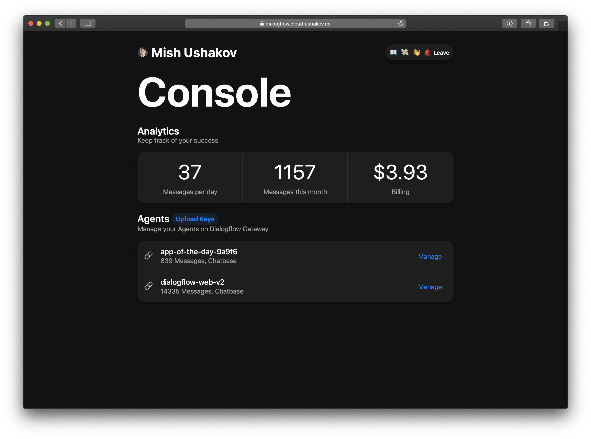
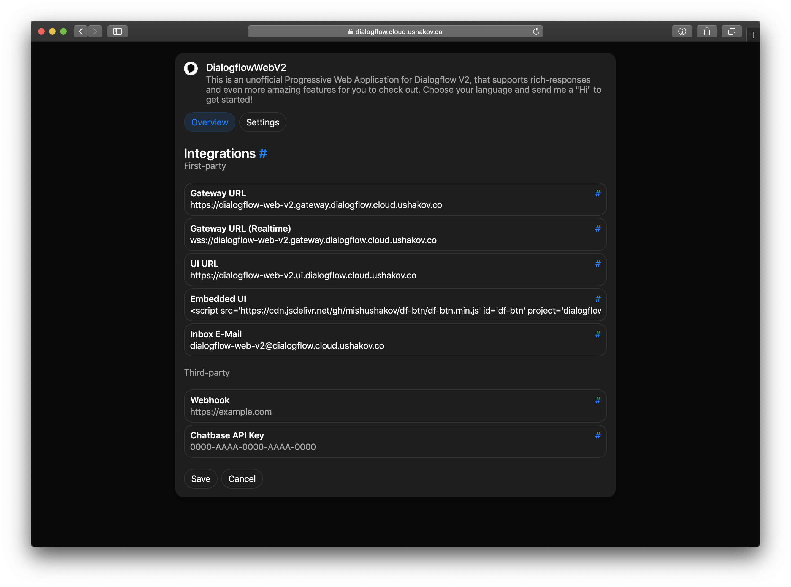
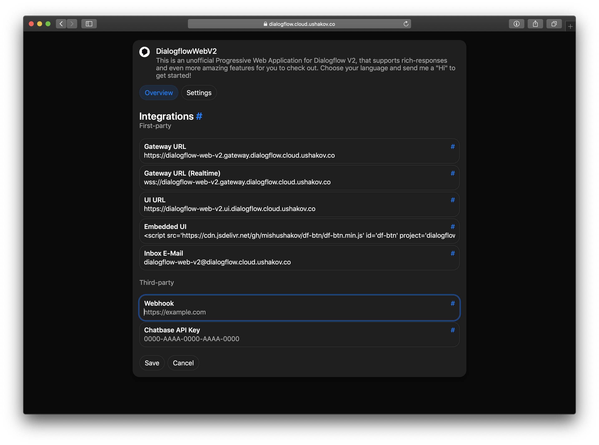
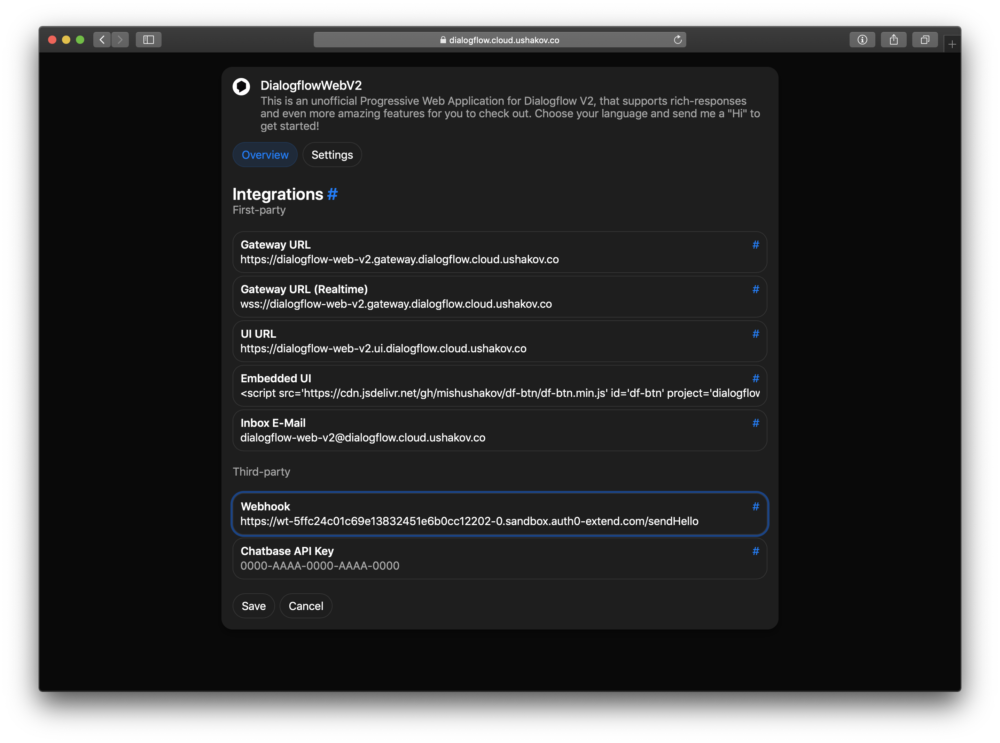
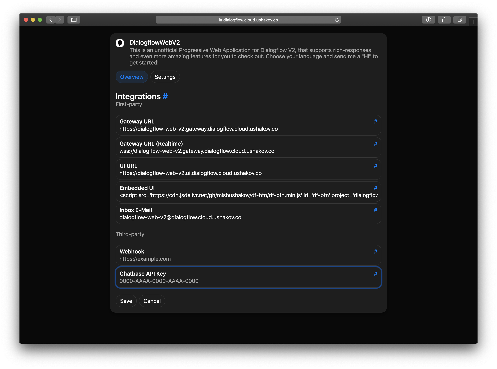
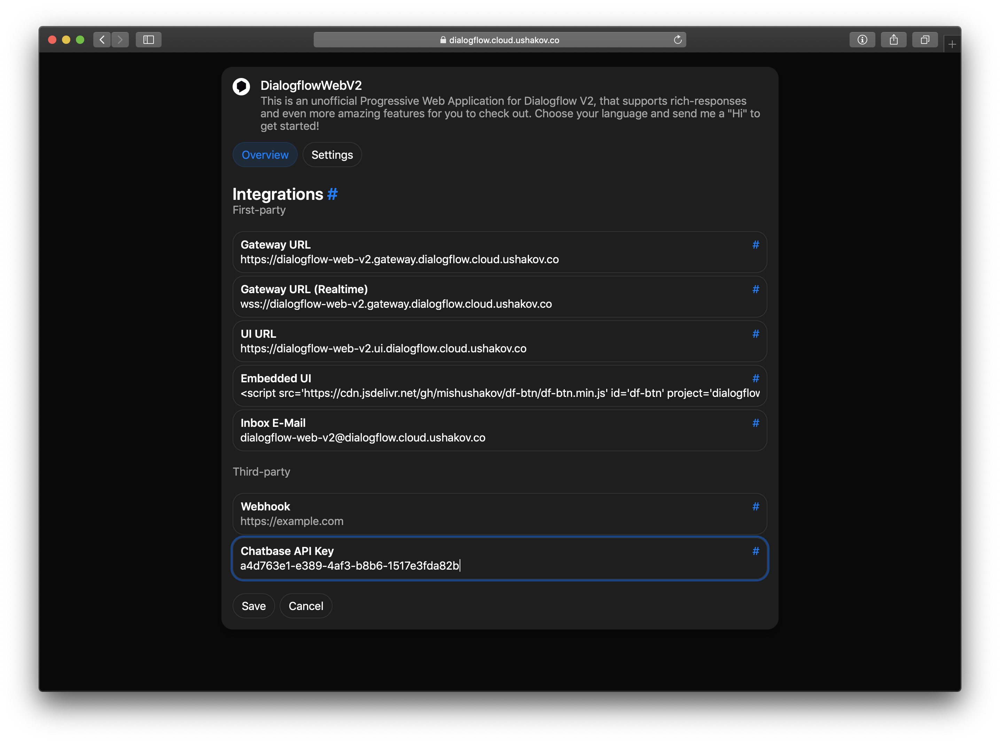
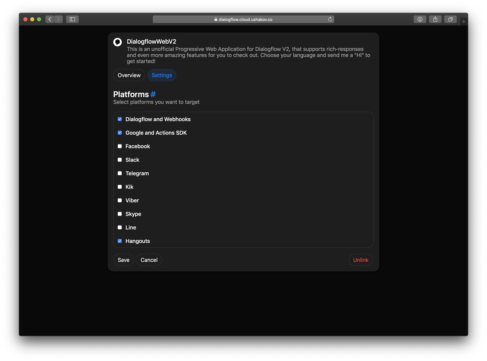
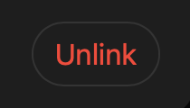

# Dialogflow Gateway by Ushakov (Hosted) Configuration

Before making any further steps, described below, please make sure, that you have successfully connected your Agent to the Gateway and it is displayed in the console:



## Get into the configuration screen

Please click on the “Manage” button on the right side of the Agent that you want to configure

The “Manage” screen should pop up:



## Configuring Webhook



The Webhook field allows you to paste a URL to a Webhook, which will receive a POST request from Dialogflow Gateway, when its triggered

You can code the webhook in any programming language or framework (in our example we will use Node and Express)

### Example Webhook

Here is the example Webhook on Webtask.io:


The code:

```js
let express = require('express')
let Webtask = require('webtask-tools')
let bodyParser = require('body-parser')
let app = express()

app.use(bodyParser.json())

app.post('/', (req, res) => {
  console.log(req.body)
  res.sendStatus(200)
})

module.exports = Webtask.fromExpress(app)
```

It will log all the incoming requests. Notice, that these are not the requests which are received by the Gateway, instead they were matched Dialogflow responses

For security reasons, i strongly recommend authenticating your requests via a secret request parameter or using CORS

On the previous screenshoot, i highlighted the URL, which corresponds to the Webhook. Paste the URL in the Console and press on "Save":



Note, that Dialogflow Gateway isn't aware of your endpoint's health. If its unavailable, you won't be able to receive requests at the time. Dialogflow Gateway isn’t going to retry and has very strict timeouts, so please make sure your webhook responds fast and is durable

## Connecting Virtual Agent Analytics



In this part of the Article, we are going to connect Google’s Area 120 [Chatbase](http://chatbase.com) Virtual Agent Analytics Service to our Dialogflow Gateway in order to get detailed Analytics of our Agent’s usage and reports from the Dialogflow Gateway Platform. Notice, that Dialogflow Gateway has no built-in service for such Analytics and does not store your message history


On top of that, Chatbase gives you cool features to play with:

* Metrics

* Session flow

* Retention

* Cohorts

* Rich Filtering

* Funnels

* Transcripts

* Sensitive Data Masking

* Grouping of not-handled messages

* Machine learning: Suggested intents for missed & misunderstood messages (Beta)

Let’s connect our Agent!

1. Sign into [Chatbase](https://chatbase.com/overview) with your Google Account:


2. Press on “Add a bot” button on the Dashboard and enter the requested info:


3. Copy the API Key for your bot:


4. Paste the API Key in your Dialogflow Gateway Integration and hit on "Save":



5. View your Analytics Data


Notice: Chatbase can take up to 24 hours to index your messages, so be patient. For your convenience Dialogflow Gateway messages are tagged as “Dialogflow gateway” platform in Chatbase

## Settings

### Platforms



This feature allows you to target Platforms you want to support through Dialogflow Gateway

### Unlink



You can press on the “Unlink” button to unlink your Agent from Dialogflow Gateway

Note: the "Unlink" button is only visible on the "Settings" tab and unlinking will not reset the messages count