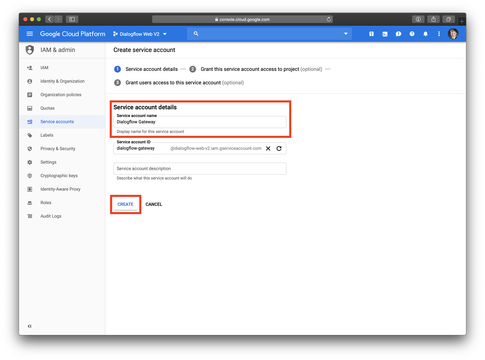
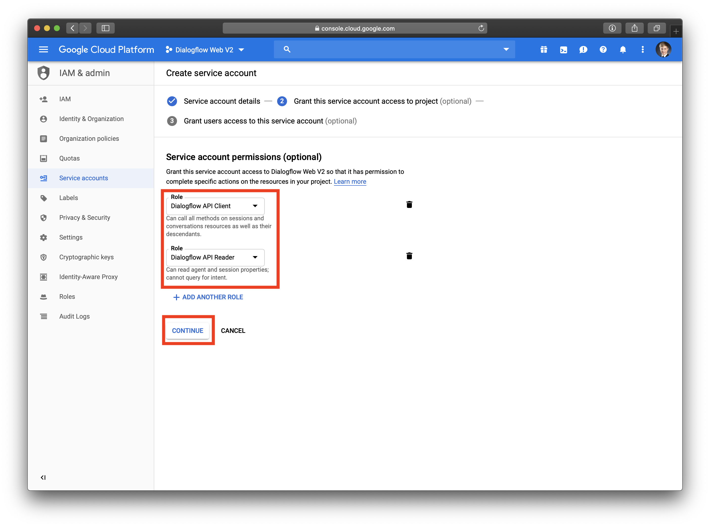
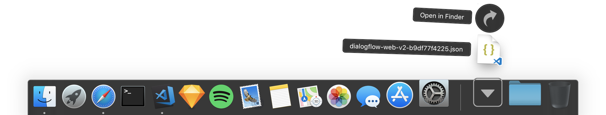
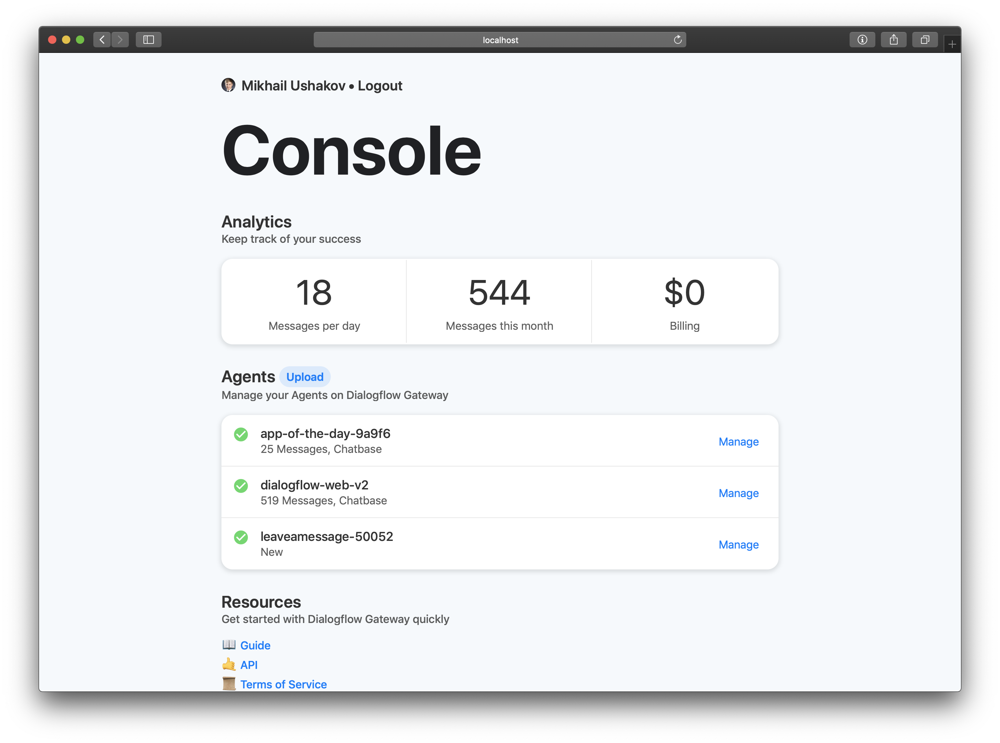
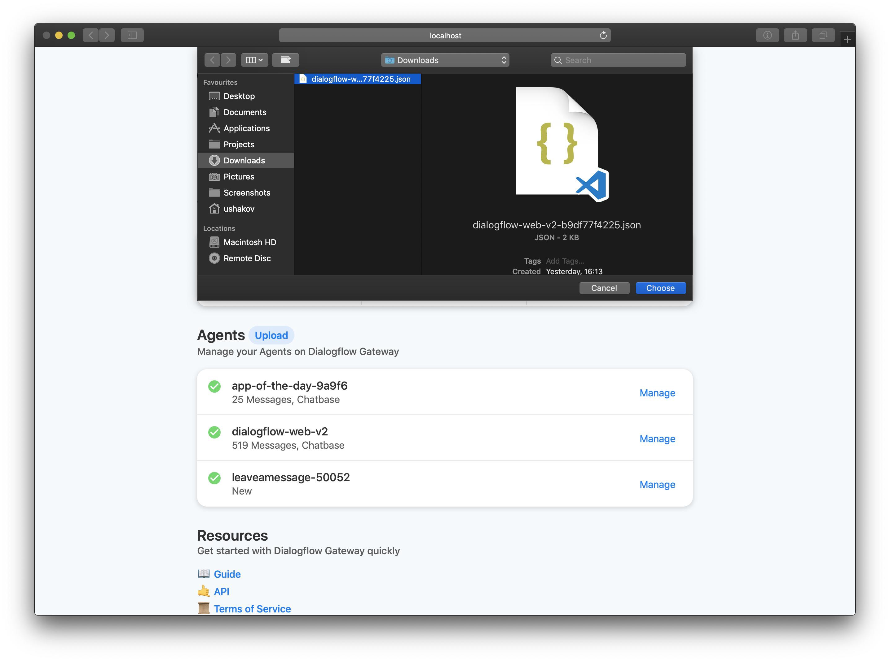
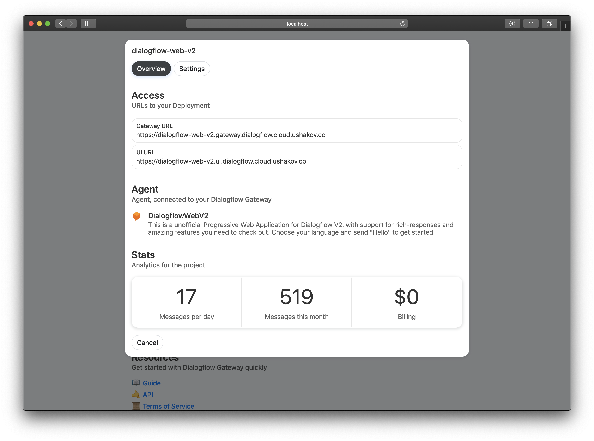

# Dialogflow Gateway by Ushakov (Hosted) Installation

## Step 1: Get a Service Account

Service Accounts represent identities of a Service (much like user account represents identity of a user). Dialogflow Gateway requires a Service Account, to authenticate the requests, as they were triggered from your service. In this step, we will generate such Service Account for your Google Cloud project, that is connected to your Agent.

Visit [Google Cloud IAM](https://console.cloud.google.com/iam-admin/serviceaccounts)

Make sure you are on the “Service Accounts” Page and have selected the Project, which your Dialogflow Agent is associated with

Then, press on the “Create Service Account” button

Enter the name of your Service Account and press on “Create”

## Step 2: Grant permissions to the Service Account

You have now successfully generated a service account! You just need to give it some permissions, so it can access certain resources of your Google Cloud project.

We will need thoose permissions: “Dialogflow API Client” and “Dialogflow API Reader”

It’s important, that you set these permissions, otherwise your integration may not work as expected

Set the Roles and press on “Continue”

## Step 3: Get the keys of the Service Account

In the this step we will generate the keys of our Service Account, which we will later give Dialogflow Gateway access to.

Press on “Create Key Button” and in the “Create Key” window set the “Key type” to “JSON”. Then, press on “Create”.

The keys should been downloaded to your default Downloads folder. Make sure to check that as well.

Now, when you have the keys with the correct permissions, you are ready to setup Dialogflow Gateway

## Final Step: Upload your keys to Dialogflow Gateway

Go to the [Dialogflow Gateway Console](https://dialogflow.cloud.ushakov.co/console)

Sign in with your Google Account

And you will see the console

In the “Agents” section press on the “Upload” button and select your keys

Your agent should now appear on the “Agents” list. To find your connection information and settings, press on the “Manage” button

Congratulations! You have successfully connected your Agent to the Gateway.

If you have any questions or need help to complete these steps, please contact [Google Cloud Support](https://cloud.google.com/support-hub/)