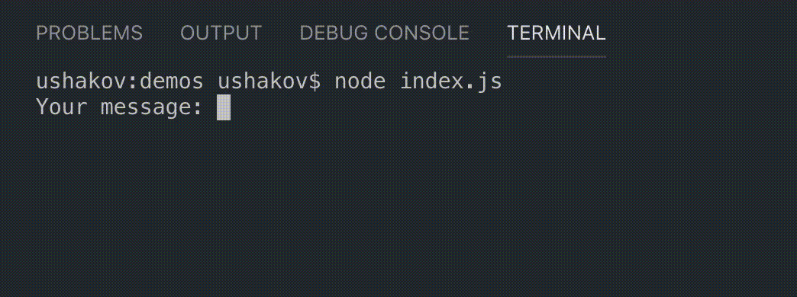
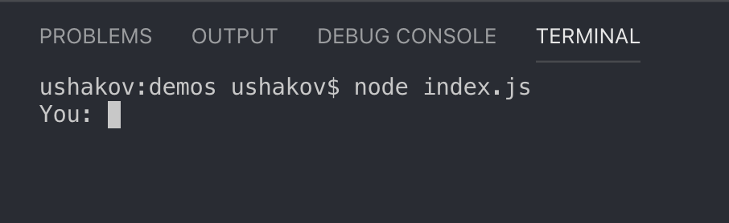
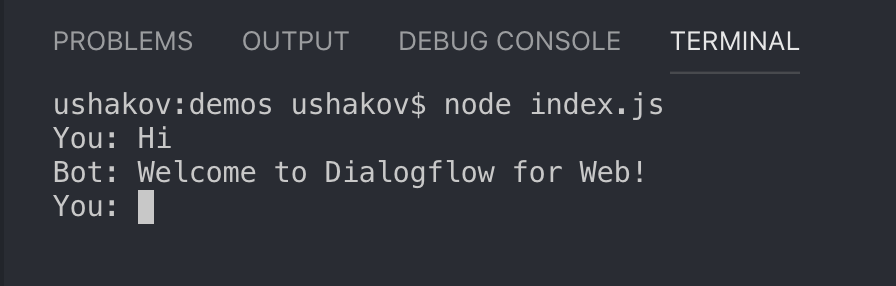

# Dialogflow Gateway by Ushakov (Hosted) Usage

In this guide we will code our own CLI-Integration for Dialogflow using [Dialogflow Gateway API](api.md.md#api) and [Dialogflow Gateway Realtime API](api.md.md#realtime-api)



It’s a badass idea, because sometimes you can’t have access to your Google Assistant, Web Browser or a Messenger, but still want to process your Messages through Dialogflow 💪

Let’s do it!

## Preparing our Integration

### Requirements

* NodeJS

* NPM or Yarn

* Agent, that is connected to Dialogflow Gateway

* 5–10 minutes of free time

### Initialising Project

1. Create new directory

2. Run `npm init` or `yarn init`

3. Create new file, called `index.js`

4. Open the file using your favourite code editor

## Coding the Integration

### Step 1: Require and install the dependencies

```js
/* Require dependencies */
const fetch = require('node-fetch')
const readline = require('readline').createInterface({
    input: process.stdin,
    output: process.stdout
})
```

1. Install the `node-fetch` dependency

   `npm i node-fetch` or `yarn add node-fetch`

### Step 2: Define the variables

```js
/* Define variables */
const appid = 'dialogflow-web-v2' // <- Google Cloud Project ID
const session = 'dialogflow-cli' // <- Session ID
const lang = 'en' // <- Language
const endpoint = `https://${appid}.gateway.dialogflow.cloud.ushakov.co` // <- Endpoint
```

### Step 3: Define the messages loop

```js
/* Define the loop */
let ask = () => {
    /* Ask for your message */
    readline.question('You: ', (message) => {
        /* Build a request */
        let request = {
            session: session,
            queryInput: {
                text: {
                    text: message,
                    languageCode: lang
                }
            }
        }

        /* Talk to endpoint and return the results */
        fetch(endpoint, {method: 'POST', body: JSON.stringify(request), headers: {'Content-Type': 'application/json'}})
        .then(res => res.json())
        .then(res => {
            let messages = res.queryResult.fulfillmentMessages
            for (let message in messages){
                /* Display Dialogflow/Webhook Messages */
                if (messages[message].text) console.log('Bot: ' + messages[message].text.text[0])

                /* Display Actions on Google Simple Response */
                else if (messages[message].simpleResponses) console.log('Bot: ' + messages[message].simpleResponses.simpleResponses[0].textToSpeech)

                ask() // <- Restart the messages loop
            }
        })
    })
}
```

### Step 4: Start the loop

```js
ask() // <- Start the messages loop
```

### Final Code

```js
/* Require dependencies */
const fetch = require('node-fetch')
const readline = require('readline').createInterface({
    input: process.stdin,
    output: process.stdout
})

/* Define variables */
const appid = 'dialogflow-web-v2' // <- Google Cloud Project ID
const session = 'dialogflow-cli' // <- Session ID
const lang = 'en' // <- Language
const endpoint = `https://${appid}.gateway.dialogflow.cloud.ushakov.co` // <- Endpoint

/* Define the loop */
let ask = () => {
    /* Ask for your message */
    readline.question('You: ', (message) => {
        /* Build a request */
        let request = {
            session: session,
            queryInput: {
                text: {
                    text: message,
                    languageCode: lang
                }
            }
        }

        /* Talk to endpoint and return the results */
        fetch(endpoint, {method: 'POST', body: JSON.stringify(request), headers: {'Content-Type': 'application/json'}})
        .then(res => res.json())
        .then(res => {
            let messages = res.queryResult.fulfillmentMessages
            for (let message in messages){
                /* Display Dialogflow/Webhook Messages */
                if (messages[message].text) console.log('Bot: ' + messages[message].text.text[0])

                /* Display Actions on Google Simple Response */
                else if (messages[message].simpleResponses) console.log('Bot: ' + messages[message].simpleResponses.simpleResponses[0].textToSpeech)

                ask() // <- Restart the messages loop
            }
        })
    })
}

ask() // <- Start the messages loop
```

### Step 5: Go test it!

Run `node index.js` and you should see this:



Type your message and press Enter:



Your Agent will reply with Dialogflow Response, Webhook or Actions on Google Simple Response! That works 🤘

## Coding the Integration (with Realtime API)

1. Add the [ws](https://www.npmjs.com/package/ws) package

   `npm i ws` or `yarn add ws`
2. Change your code a little bit (hope you can do `diff` by yourself):
   ```js
    /* Require dependencies */
    const WebSocket = require('ws')
    const readline = require('readline').createInterface({
        input: process.stdin,
        output: process.stdout
    })

    /* Define variables */
    const appid = 'dialogflow-web-v2' // <- Google Cloud Project ID
    const session = 'dialogflow-cli' // <- Session ID
    const lang = 'en' // <- Language
    const endpoint = `wss://${appid}.gateway.dialogflow.cloud.ushakov.co/` // <- Endpoint
    const wss = new WebSocket(endpoint)
    wss.on('message', message => {
        let res = JSON.parse(message)
        let messages = res.queryResult.fulfillmentMessages
        for (let message in messages){
            /* Display Dialogflow/Webhook Messages */
            if (messages[message].text) console.log('Bot: ' + messages[message].text.text[0])
            /* Display Actions on Google Simple Response */
            else if (messages[message].simpleResponses) console.log('Bot: ' + messages[message].simpleResponses.simpleResponses[0].textToSpeech)
            ask() // <- Restart the messages loop
        }
    })

    /* Define the loop */
    let ask = () => {
        /* Ask for your message */
        readline.question('You: ', (message) => {
            /* Build a request */
            let request = {
                session: session,
                queryInput: {
                    text: {
                        text: message,
                        languageCode: lang
                    }
                }
            }

            /* Talk to endpoint and return the results */
            wss.send(JSON.stringify(request))
        })
    }

    ask() // <- Start the messages loop
   ```
3. Run that!

I hope you have now learned the basics on how to build cool, stunning and simple Dialogflow integrations using Dialogflow Gateway APIs! Now is your turn to make some 😄